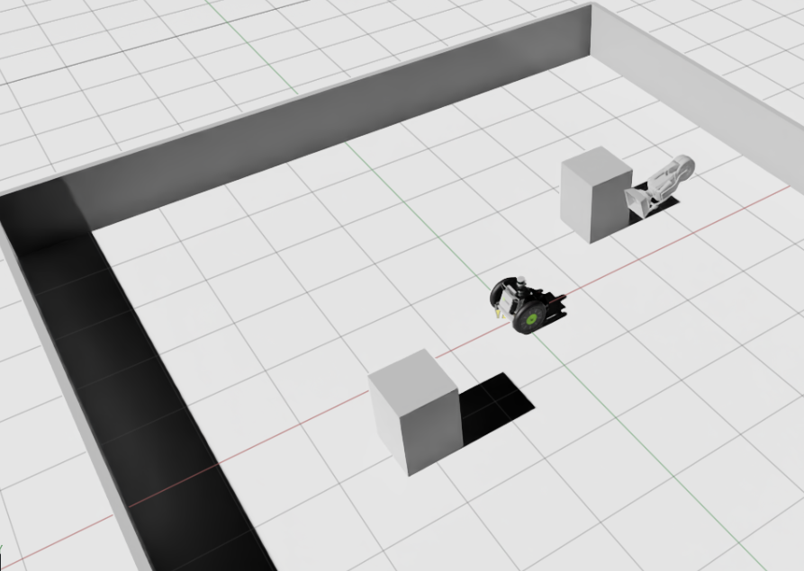

# Isaac AMR Mobile Manipulator

Isaac Sim-based autonomous mobile manipulator project integrating AMR navigation, ROS2, EKF/SLAM localization, A* path planning, MPC control, vision-based perception, and pick-and-place manipulation in a warehouse simulation environment.

This project is an extension of a previously completed Gazebo-based AMR autonomy stack. The goal is to migrate and validate the navigation stack in NVIDIA Isaac Sim, then extend it into a mobile manipulation system capable of autonomous navigation, object detection, picking, and returning to the start position.



---

## Project Goal

The final target is to build an autonomous warehouse mission scenario in Isaac Sim:

1. The AMR starts from an initial position in a warehouse environment.
2. The robot navigates to a picking location using SLAM, EKF localization, A* global planning, and MPC path tracking.
3. A vision-based perception module detects target objects using YOLO.
4. A robot arm performs pick-and-place manipulation.
5. The mobile manipulator returns to the start or delivery location.
6. The full mission is evaluated through success rate, tracking error, latency, and robustness metrics.

This repository is currently under active development.

---

## Current Status

### Completed

- Isaac Sim warehouse environment setup
- Isaac Sim Carter mobile base integration
- ROS2 `/cmd_vel` control through Isaac Sim Action Graph
- `/odom`, `/imu`, `/scan_raw` sensor pipeline
- `/scan_raw` to `/scan` correction node for SLAM compatibility
- Static TF setup for LiDAR and IMU frames
- EKF odometry integration
- SLAM Toolbox mapping mode validation
- Isaac Sim warehouse map generation and saving
- SLAM Toolbox localization mode using the saved Isaac Sim map
- Map-based EKF localization
- MPC trajectory tracking without global planning
- A* global path planning with `/planned_path`
- MPC global path tracking using A* path
- Isaac Sim-specific ROS2 navigation bringup launch file

### In Progress / Planned

- Camera sensor integration
- YOLO-based object detection
- Camera-based obstacle and object localization
- Perception-aware navigation
- Robot arm integration
- MoveIt2-based manipulation planning
- Pick-and-place state machine
- Full autonomous mobile manipulation demo

---

## System Architecture

```text
NVIDIA Isaac Sim
 ├── Carter Mobile Base
 ├── Warehouse Environment
 ├── LiDAR / IMU / Odometry Sensors
 └── ROS2 Bridge
        ↓
ROS2 Humble Navigation Stack
 ├── scan_fix_node
 │    └── /scan_raw → /scan
 ├── ekf_node
 │    └── /odom + /imu → /ekf/odom
 ├── slam_toolbox
 │    └── /scan + /ekf/odom → /map + map→odom TF
 ├── map_ekf_node
 │    └── map-frame localization refinement
 ├── path_planner_node
 │    └── A* global path planning → /planned_path
 └── mpc_node
      └── MPC path tracking → /cmd_vel
        ↓
Isaac Sim Carter Motion
```

Planned perception and manipulation extension:

```text
Isaac Sim RGB-D Camera
      ↓
YOLO Detector
      ↓
Object / Human Detection
      ↓
Perception-aware Navigation
      ↓
Mobile Manipulator Pick-and-Place
```

---

## Technology Stack

### Simulation

- NVIDIA Isaac Sim
- PhysX-based robot simulation
- Isaac Sim ROS2 Bridge
- RTX LiDAR / simulated IMU / odometry

### Middleware

- ROS2 Humble
- TF2
- SLAM Toolbox
- ROS2 launch system

### Navigation

- EKF-based odometry fusion
- SLAM Toolbox mapping and localization
- A* global path planner
- Model Predictive Control
- Map-frame EKF localization
- Planned obstacle-aware navigation extension

### Perception

Planned:

- RGB-D camera
- YOLO-based object detection
- Camera-to-base coordinate transformation
- Object pose estimation
- Semantic obstacle handling

### Manipulation

Planned:

- Robot arm integration in Isaac Sim
- MoveIt2 motion planning
- Pick-and-place state machine
- Gripper control
- AMR-arm coordination

---

## Development Roadmap

### Phase 1 — Isaac Sim Foundation

- Install and validate Isaac Sim environment
- Build warehouse simulation scene
- Add mobile robot model
- Validate physics and ROS2 bridge
- Confirm `/cmd_vel` control

### Phase 2 — Navigation Stack Migration

- Connect Isaac Sim sensor topics to ROS2
- Validate `/odom`, `/imu`, `/scan`
- Integrate EKF odometry
- Run SLAM Toolbox in mapping mode
- Save Isaac Sim warehouse map
- Run SLAM Toolbox in localization mode
- Integrate map-based EKF
- Validate MPC tracking
- Validate A* + MPC global path tracking

### Phase 3 — Vision Perception

- Add RGB-D camera to the mobile base
- Publish camera topics to ROS2
- Implement YOLO detector node
- Detect target boxes and human obstacles
- Estimate object position using depth data

### Phase 4 — Perception-aware Navigation

- Convert YOLO detections into obstacle information
- Fuse LiDAR and camera-based obstacle observations
- Apply semantic safety distance
- Validate human-aware obstacle avoidance

### Phase 5 — Manipulation

- Add robot arm to the AMR platform
- Configure MoveIt2
- Validate joint state and trajectory control
- Implement basic pick-and-place motion

### Phase 6 — Full Mission Demo

- Navigate to picking location
- Detect target object
- Execute pick operation
- Return to start or delivery zone
- Log mission success and failure cases
- Package demo video and final README

---

## Current Isaac Sim Navigation Bringup

This project uses an Isaac Sim-specific launch file instead of the original Gazebo bringup.

The original AMR project used a Gazebo-based launch file that started Gazebo, spawned the robot, and launched `ros_gz_bridge`. In this Isaac Sim version, simulation is handled directly by Isaac Sim, so only the ROS2-side autonomy nodes are launched.

Example: MPC tracking without global planner

```bash
ros2 launch scenarios isaac_navigation_bringup.launch.py \
  start_mpc:=true \
  use_global_planner:=false \
  trajectory_type:=straight \
  v_ref:=0.05 \
  v_max:=0.10 \
  w_max:=0.5 \
  cbf_enabled:=false
```

Example: A* global planning + MPC tracking

```bash
ros2 launch scenarios isaac_navigation_bringup.launch.py \
  start_planner:=true \
  start_mpc:=true \
  use_global_planner:=true \
  goal_x:=1.0 \
  goal_y:=0.0 \
  v_ref:=0.05 \
  v_max:=0.10 \
  w_max:=0.5 \
  cbf_enabled:=false
```

Before running the launch file, Isaac Sim must already be open and in Play mode.

---

## SLAM Map Workflow

During mapping mode:

```bash
ros2 launch localization slam.launch.py
```

After generating a map in RViz, save both the occupancy map and pose graph:

```bash
ros2 service call /slam_toolbox/save_map slam_toolbox/srv/SaveMap \
"{name: {data: '/home/lyj/isaac_amr_ws/maps/isaac_warehouse_map'}}"
```

```bash
ros2 service call /slam_toolbox/serialize_map slam_toolbox/srv/SerializePoseGraph \
"{filename: '/home/lyj/isaac_amr_ws/maps/isaac_warehouse_map'}"
```

Expected output files:

```text
isaac_warehouse_map.yaml
isaac_warehouse_map.pgm
isaac_warehouse_map.posegraph
isaac_warehouse_map.data
```

For localization mode, configure SLAM Toolbox to load the saved Isaac Sim map.

---

## Key Engineering Decisions

### Isaac Sim Carter Base

The project initially attempted to import a custom AMR URDF model into Isaac Sim. However, wheel collision and PhysX contact issues prevented stable ground motion. To keep the project focused on autonomy stack integration rather than low-level robot asset debugging, the mobile base was switched to the Isaac Sim Carter robot.

This decision allows the project to focus on:

- ROS2 autonomy stack migration
- Localization and mapping
- A* path planning
- MPC tracking
- Perception-aware navigation
- Mobile manipulation integration

### Gazebo Bringup Separation

The original AMR launch file is Gazebo-specific and includes Gazebo execution, robot spawning, and ROS-Gazebo bridging. For Isaac Sim, a separate launch file is used to avoid simulator conflicts and only run the required ROS2 autonomy nodes.

---

## Evaluation Metrics

Planned evaluation metrics include:

| Metric | Target |
|---|---:|
| MPC solve time | < 20 ms |
| End-to-end control latency | < 50 ms |
| Tracking RMSE | < 0.15 m |
| YOLO detection FPS | > 10 FPS |
| Human obstacle avoidance success rate | > 95% |
| Pick-and-place success rate | > 80% |
| Full mission success rate | > 80% |

Current navigation tests show MPC solve time in the low-millisecond range during Isaac Sim integration tests.

---

## Repository Structure

Planned structure:

```text
isaac_amr_ws/
├── src/
│   ├── control_mpc/
│   ├── estimation/
│   ├── localization/
│   ├── planning/
│   ├── scenarios/
│   ├── perception/          # planned
│   └── manipulation/        # planned
├── maps/
│   └── isaac_warehouse_map.*
├── tools/
│   └── scan_fix_node.py
├── assets/
│   └── Isaac Sim USD assets
└── README.md
```

---

## Portfolio Highlights

This project demonstrates:

- Migration of a Gazebo-based AMR autonomy stack to NVIDIA Isaac Sim
- ROS2-based integration between simulator sensors and autonomy nodes
- EKF, SLAM, A* planning, and MPC control in a closed-loop simulation
- Practical troubleshooting of simulator-specific sensor and TF issues
- Isaac Sim warehouse map generation and localization
- Preparation for vision-based perception and mobile manipulation
- Full-stack robotics system integration from simulation to autonomy logic

---

## Project Status

This project is actively being developed.

Current milestone:

```text
Week 3 completed:
Isaac Sim navigation stack migration and MPC path tracking validation
```

Next milestone:

```text
Week 4:
Camera sensor integration and YOLO-based perception pipeline
```
